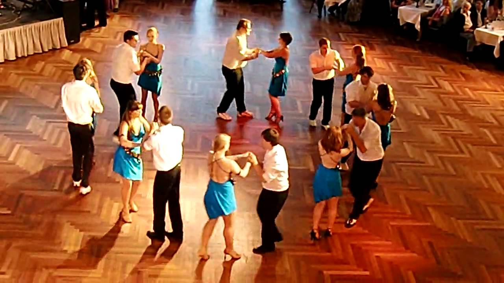
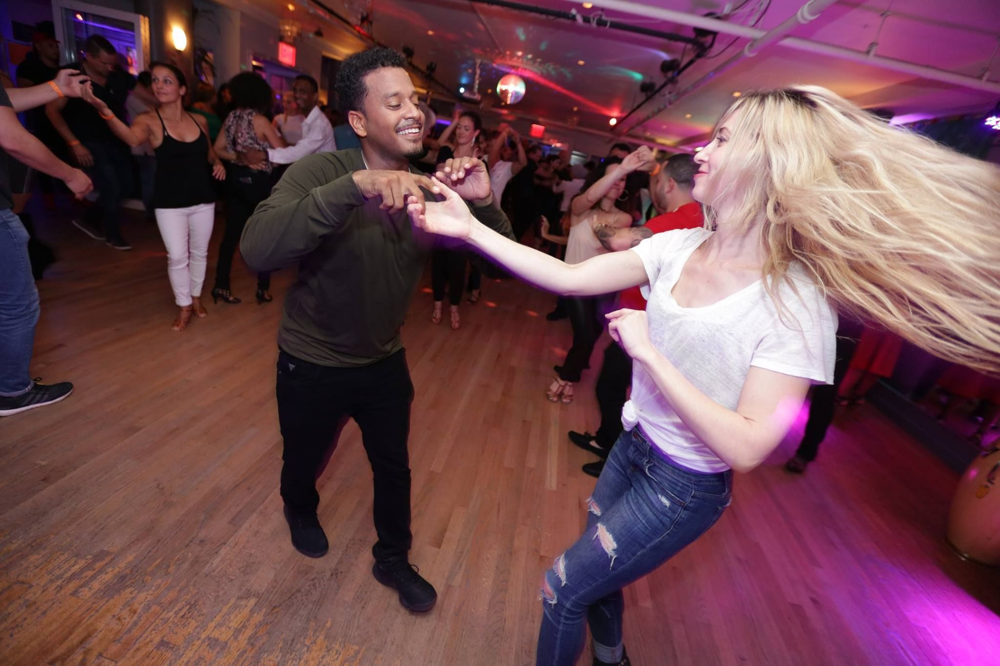
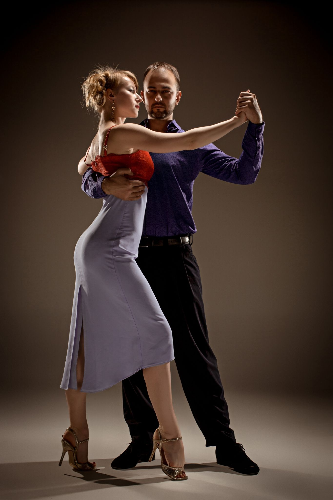
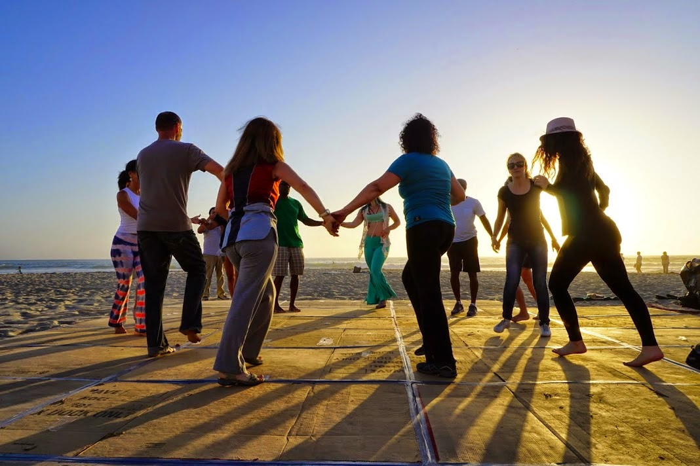
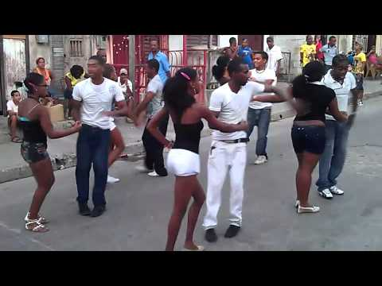
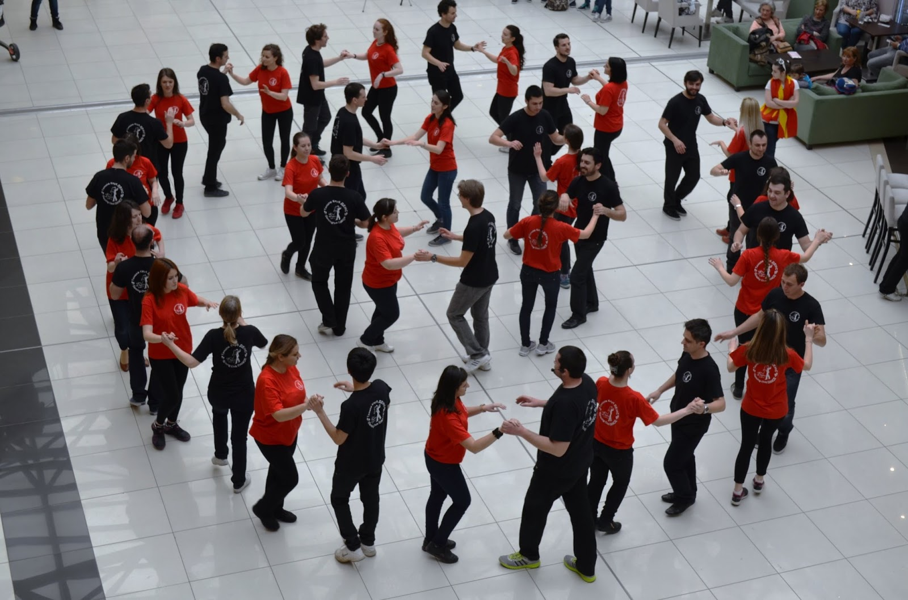

# Cuban salsa dancing
## (Rueda de Casino)

---

## Salsa in the US:
### New York salsa
<!-- .slide: style="text-align: left;"> -->
- Cuban musician influence in the 40s and 50s
- Puerto Rican influence thereafter. Also jazz
- Became very popular in the 70s and 80s thanks to the disco scene at the time
- Known as NY salsa, mambo, salsa on 2, or on 2

---

## Salsa in the US:
### LA salsa
<!-- .slide: style="text-align: left;"> -->
- Influenced by Puerto Rican salsa and ballroom
- Known as LA salsa, salsa on 1, or on 1

---

## Salsa in Cuba
<!-- .slide: style="text-align: left;"> -->
- Cuban salsa music has a distinct flavor known as timba
- Prior to the cuban revolution, dancing was commonly held in casinos
- Afterwards, not so much. Interestingly enough this is what helped put Vegas on the map
- Casino is the name of the partner style dance in cuban salsa
- In the late 50s and early 60s, the group dance known as Rueda de Casino was born in Havana
- Rueda == wheel/circle

---

## Salsa in the US:
### Miami salsa
<!-- .slide: style="text-align: left;"> -->
- In the 80s and 90s many cubans who immigrated to the US made rueda popular in Miami
- This also had a disco influence as well
- Known as miami style, rueda de casino, cuban salsa, or rueda

---

## Technical details
<!-- .slide: style="text-align: left;"> -->
- Group dance done in a circle
- Caller is the person who decides what moves the group performs
- Partner exchanges are what makes this a group dance

---

## What are the basics?
<!-- .slide: style="text-align: left;"> -->
- Leader on the right, follower on the left. Each sort of facing each other and the middle of the circle
- Guapea is the basic step. Means swagger or bragging
- Dame is the basic partner exchange move. Means give me
- Dile que no is the move to bring the follower from the right side of the leader back to the left side. Means tell her no
- Each move has a hand signal associated with it

---

## Why is it so much fun?
<!-- .slide: style="text-align: left;"> -->
- Art + Sports + Puzzles

---

## See it in action
<!-- .slide: style="text-align: left;"> -->
https://youtu.be/7xpjG-mV5qc